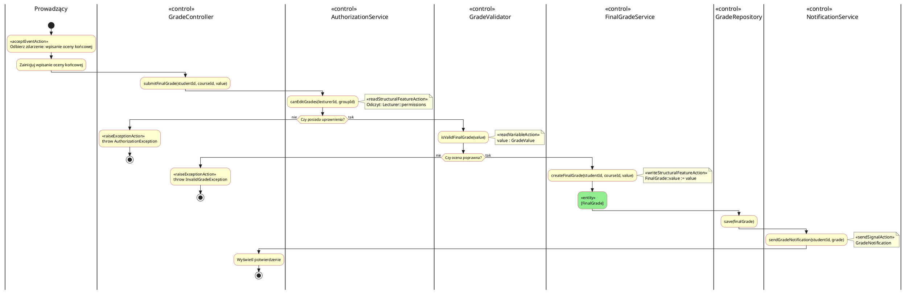

```plantuml
@startuml
skinparam style strictuml
skinparam DefaultFontName Arial
skinparam ActivityBackgroundColor #FEFECE
skinparam ActivityBorderColor #A80036

|Prowadzący|
start

:«acceptEventAction»\nOdbierz zdarzenie: wpisanie oceny końcowej;

:Zainicjuj wpisanie oceny końcowej;

|<<control>>\nGradeController|
:submitFinalGrade(studentId, courseId, value);

|<<control>>\nAuthorizationService|
:canEditGrades(lecturerId, groupId);
note right
  «readStructuralFeatureAction»
  Odczyt: Lecturer::permissions
end note

if (Czy posiada uprawnienia?) then (nie)
    |<<control>>\nGradeController|
    :«raiseExceptionAction»\nthrow AuthorizationException;
    stop
else (tak)
    |<<control>>\nGradeValidator|
    :isValidFinalGrade(value);
    note right
      «readVariableAction»
      value : GradeValue
    end note
    if (Czy ocena poprawna?) then (nie)
        |<<control>>\nGradeController|
        :«raiseExceptionAction»\nthrow InvalidGradeException;
        stop
    else (tak)
        |<<control>>\nFinalGradeService|
        :createFinalGrade(studentId, courseId, value);
        note right
          «writeStructuralFeatureAction»
          FinalGrade::value := value
        end note

        #LightGreen:<<entity>>\n[FinalGrade];

        |<<control>>\nGradeRepository|
        :save(finalGrade);

        |<<control>>\nNotificationService|
        :sendGradeNotification(studentId, grade);
        note right
          «sendSignalAction»
          GradeNotification
        end note

        |<<control>>\nGradeController|
        :Wyświetl potwierdzenie;
        stop
    endif
endif
@enduml
```
