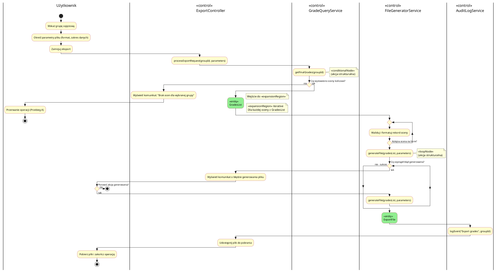

```plantuml
@startuml
skinparam style strictuml
skinparam DefaultFontName Arial
skinparam ActivityBackgroundColor #FEFECE
skinparam ActivityBorderColor #A80036
skinparam conditionStyle diamond

|Użytkownik|
start
:Wskaż grupę zajęciową;
:Określ parametry pliku (format, zakres danych);
:Zainicjuj eksport;

|<<control>>\nExportController|
:processExportRequest(groupId, parameters);

|<<control>>\nGradeQueryService|
:getFinalGrades(groupId);
note right
  «conditionalNode»
  (akcja strukturalna)
end note

if (Czy wystawiono oceny końcowe?) then (nie)
    |<<control>>\nExportController|
    :Wyświetl komunikat: "Brak ocen dla wybranej grupy";

    |Użytkownik|
    :Przerwanie operacji (Przebieg A);
    stop
else (tak)

    |<<control>>\nExportController|
    #LightGreen:<<entity>>\nGradesList;
    note right
      Wejście do «expansionRegion»
    end note

    |<<control>>\nFileGeneratorService|
    note right
      «expansionRegion» iterative
      Dla każdej oceny z GradesList
    end note
    repeat
        :Waliduj i formatuj rekord oceny;
    repeat while (Kolejna ocena na liście?) is (tak) not (nie)

    :generateFile(gradesList, parameters);

    note right
      «loopNode»
      (akcja strukturalna)
    end note
    while (Czy wystąpił błąd generowania?) is (tak)
        |<<control>>\nExportController|
        :Wyświetl komunikat o błędzie generowania pliku;

        |Użytkownik|
        if (Ponowić akcję generowania?) then (nie)
            stop
        else (tak)
            |<<control>>\nFileGeneratorService|
            :generateFile(gradesList, parameters);
        endif
    endwhile (nie - sukces)

    #LightGreen:<<entity>>\nExportFile;

    |<<control>>\nAuditLogService|
    :logEvent("Export grades", groupId);

    |<<control>>\nExportController|
    :Udostępnij plik do pobrania;

    |Użytkownik|
    :Pobierz plik i zakończ operację;
    stop
endif

@enduml
```
