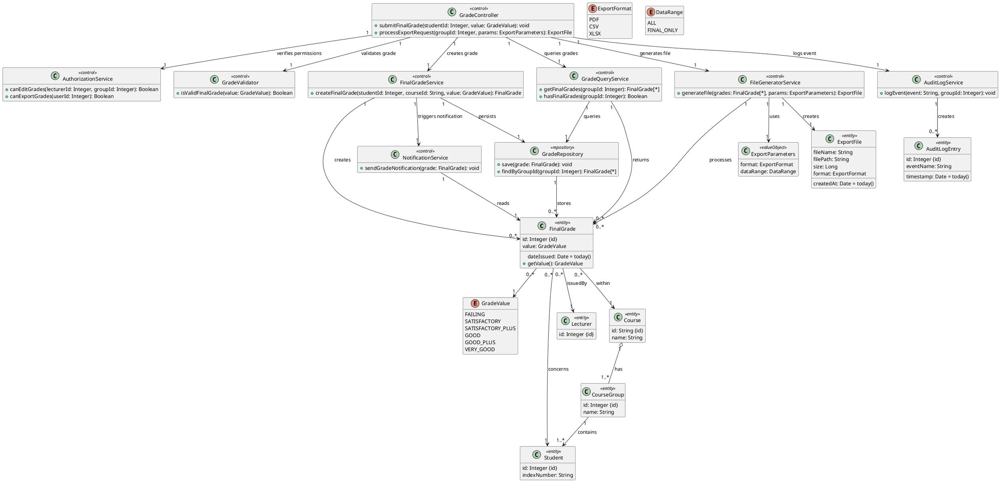

```plantuml
@startuml
hide empty members
 
' ─────────────────────────────────────────────
' Domain entities
' ─────────────────────────────────────────────
 
class FinalGrade <<entity>> {
    id: Integer {id}
    value: GradeValue
    dateIssued: Date = today()
    + getValue(): GradeValue
}
 
enum GradeValue {
    FAILING
    SATISFACTORY
    SATISFACTORY_PLUS
    GOOD
    GOOD_PLUS
    VERY_GOOD
}
 
class ExportParameters <<valueObject>> {
    format: ExportFormat
    dataRange: DataRange
}
 
class ExportFile <<entity>> {
    fileName: String
    filePath: String
    size: Long
    format: ExportFormat
    createdAt: Date = today()
}
 
class AuditLogEntry <<entity>> {
    id: Integer {id}
    eventName: String
    timestamp: Date = today()
}
 
enum ExportFormat {
    PDF
    CSV
    XLSX
}
 
enum DataRange {
    ALL
    FINAL_ONLY
}
 
' ─────────────────────────────────────────────
' Reference classes (defined in main class diagram)
' ─────────────────────────────────────────────
 
class Student <<entity>> {
    id: Integer {id}
    indexNumber: String
}
 
class Lecturer <<entity>> {
    id: Integer {id}
}
 
class Course <<entity>> {
    id: String {id}
    name: String
}
 
class CourseGroup <<entity>> {
    id: Integer {id}
    name: String
}
 
' ─────────────────────────────────────────────
' Controllers
' ─────────────────────────────────────────────
 
class GradeController <<control>> {
    + submitFinalGrade(studentId: Integer, value: GradeValue): void
    + processExportRequest(groupId: Integer, params: ExportParameters): ExportFile
}
 
' ─────────────────────────────────────────────
' Services
' ─────────────────────────────────────────────
 
class AuthorizationService <<control>> {
    + canEditGrades(lecturerId: Integer, groupId: Integer): Boolean
    + canExportGrades(userId: Integer): Boolean
}
 
class GradeValidator <<control>> {
    + isValidFinalGrade(value: GradeValue): Boolean
}
 
class FinalGradeService <<control>> {
    + createFinalGrade(studentId: Integer, courseId: String, value: GradeValue): FinalGrade
}
 
class GradeQueryService <<control>> {
    + getFinalGrades(groupId: Integer): FinalGrade[*]
    + hasFinalGrades(groupId: Integer): Boolean
}
 
class FileGeneratorService <<control>> {
    + generateFile(grades: FinalGrade[*], params: ExportParameters): ExportFile
}
 
class NotificationService <<control>> {
    + sendGradeNotification(grade: FinalGrade): void
}
 
class AuditLogService <<control>> {
    + logEvent(event: String, groupId: Integer): void
}
 
class GradeRepository <<repository>> {
    + save(grade: FinalGrade): void
    + findByGroupId(groupId: Integer): FinalGrade[*]
}
 
' ─────────────────────────────────────────────
' Relations — domain
' ─────────────────────────────────────────────
 
FinalGrade "0..*" --> "1" Student      : concerns
FinalGrade "0..*" --> "1" Lecturer     : issuedBy
FinalGrade "0..*" --> "1" Course       : within
FinalGrade "0..*" --> "1" GradeValue
 
Course "1" o-- "1..*" CourseGroup      : has
CourseGroup "1" --> "1..*" Student     : contains
 
' ─────────────────────────────────────────────
' Relations — controller to services
' ─────────────────────────────────────────────
 
GradeController "1" --> "1" AuthorizationService  : verifies permissions
GradeController "1" --> "1" GradeValidator        : validates grade
GradeController "1" --> "1" FinalGradeService     : creates grade
GradeController "1" --> "1" GradeQueryService     : queries grades
GradeController "1" --> "1" FileGeneratorService  : generates file
GradeController "1" --> "1" AuditLogService       : logs event
 
' ─────────────────────────────────────────────
' Relations — services to repository and entities
' ─────────────────────────────────────────────
 
FinalGradeService "1" --> "1"    GradeRepository     : persists
FinalGradeService "1" --> "0..*" FinalGrade          : creates
FinalGradeService "1" --> "1"    NotificationService : triggers notification
 
GradeQueryService "1" --> "1"    GradeRepository     : queries
GradeQueryService "1" --> "0..*" FinalGrade          : returns
 
FileGeneratorService "1" --> "0..*" FinalGrade       : processes
FileGeneratorService "1" --> "1"    ExportParameters : uses
FileGeneratorService "1" --> "1"    ExportFile       : creates
 
NotificationService "1" --> "1" FinalGrade        : reads
 
AuditLogService "1" --> "0..*" AuditLogEntry         : creates
 
GradeRepository "1" --> "0..*" FinalGrade            : stores
 
@enduml
```