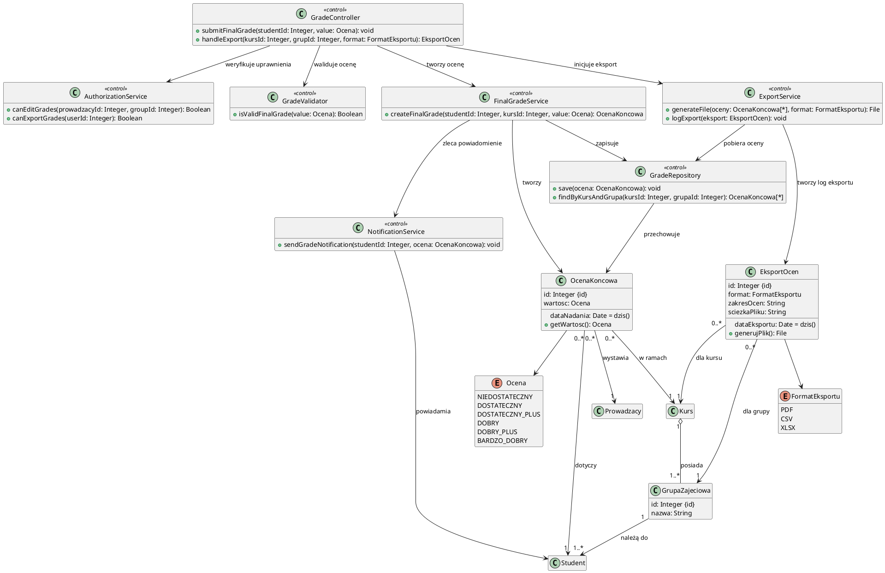

```plantuml
@startuml
hide empty members

' ─────────────────────────────────────────────
' Klasy dziedzinowe (encje)
' ─────────────────────────────────────────────

class OcenaKoncowa {
    id: Integer {id}
    wartosc: Ocena
    dataNadania: Date = dzis()
    + getWartosc(): Ocena
}

enum Ocena {
    NIEDOSTATECZNY
    DOSTATECZNY
    DOSTATECZNY_PLUS
    DOBRY
    DOBRY_PLUS
    BARDZO_DOBRY
}

class EksportOcen {
    id: Integer {id}
    dataEksportu: Date = dzis()
    format: FormatEksportu
    zakresOcen: String
    sciezkaPliku: String
    + generujPlik(): File
}

enum FormatEksportu {
    PDF
    CSV
    XLSX
}

' ─────────────────────────────────────────────
' Serwisy (warstwy logiki — z diagramu aktywności)
' ─────────────────────────────────────────────

class GradeController <<control>> {
    + submitFinalGrade(studentId: Integer, value: Ocena): void
    + handleExport(kursId: Integer, grupId: Integer, format: FormatEksportu): EksportOcen
}

class AuthorizationService <<control>> {
    + canEditGrades(prowadzacyId: Integer, groupId: Integer): Boolean
    + canExportGrades(userId: Integer): Boolean
}

class GradeValidator <<control>> {
    + isValidFinalGrade(value: Ocena): Boolean
}

class FinalGradeService <<control>> {
    + createFinalGrade(studentId: Integer, kursId: Integer, value: Ocena): OcenaKoncowa
}

class GradeRepository <<control>> {
    + save(ocena: OcenaKoncowa): void
    + findByKursAndGrupa(kursId: Integer, grupaId: Integer): OcenaKoncowa[*]
}

class NotificationService <<control>> {
    + sendGradeNotification(studentId: Integer, ocena: OcenaKoncowa): void
}

class ExportService <<control>> {
    + generateFile(oceny: OcenaKoncowa[*], format: FormatEksportu): File
    + logExport(eksport: EksportOcen): void
}

' ─────────────────────────────────────────────
' Powiązania z istniejącymi klasami (referencja)
' ─────────────────────────────────────────────

class Student
class Prowadzacy
class Kurs
class GrupaZajeciowa {
    id: Integer {id}
    nazwa: String
}

' ─────────────────────────────────────────────
' Relacje
' ─────────────────────────────────────────────

' OcenaKoncowa jest wystawiana studentowi przez prowadzącego w ramach kursu
OcenaKoncowa "0..*" --> "1" Student       : dotyczy
OcenaKoncowa "0..*" --> "1" Prowadzacy    : wystawia
OcenaKoncowa "0..*" --> "1" Kurs          : w ramach
OcenaKoncowa  --> Ocena

' Eksport operuje na grupie i kursie, generuje log
EksportOcen "0..*" --> "1" Kurs           : dla kursu
EksportOcen "0..*" --> "1" GrupaZajeciowa : dla grupy
EksportOcen --> FormatEksportu

' Kurs ma grupy zajęciowe
Kurs "1" o-- "1..*" GrupaZajeciowa        : posiada
GrupaZajeciowa "1" --> "1..*" Student     : należą do

' Przepływ sterowania (z diagramu aktywności)
GradeController --> AuthorizationService  : weryfikuje uprawnienia
GradeController --> GradeValidator        : waliduje ocenę
GradeController --> FinalGradeService     : tworzy ocenę
GradeController --> ExportService         : inicjuje eksport

FinalGradeService --> GradeRepository    : zapisuje
FinalGradeService --> OcenaKoncowa       : tworzy

GradeRepository --> OcenaKoncowa         : przechowuje

NotificationService --> Student          : powiadamia
FinalGradeService --> NotificationService : zleca powiadomienie

ExportService --> GradeRepository        : pobiera oceny
ExportService --> EksportOcen            : tworzy log eksportu

@enduml

```