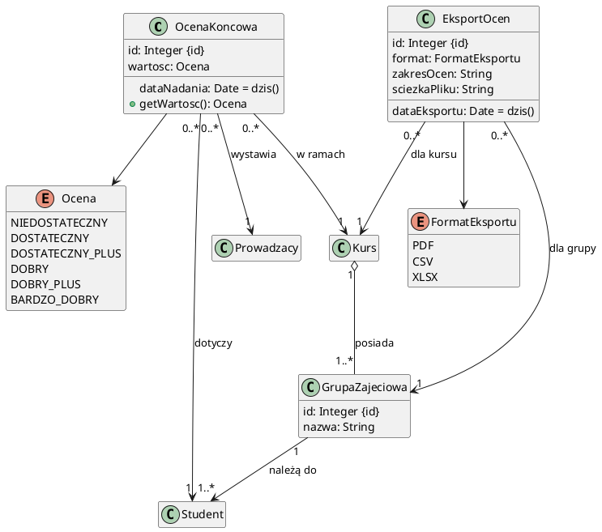

```plantuml

@startuml
hide empty members

' ─────────────────────────────────────────────
' Klasy dziedzinowe (encje)
' ─────────────────────────────────────────────

class OcenaKoncowa {
    id: Integer {id}
    wartosc: Ocena
    dataNadania: Date = dzis()
    + getWartosc(): Ocena
}

enum Ocena {
    NIEDOSTATECZNY
    DOSTATECZNY
    DOSTATECZNY_PLUS
    DOBRY
    DOBRY_PLUS
    BARDZO_DOBRY
}

class EksportOcen {
    id: Integer {id}
    dataEksportu: Date = dzis()
    format: FormatEksportu
    zakresOcen: String
    sciezkaPliku: String
}

enum FormatEksportu {
    PDF
    CSV
    XLSX
}

' ─────────────────────────────────────────────
' Powiązania z istniejącymi klasami (referencja)
' ─────────────────────────────────────────────

class Student
class Prowadzacy
class Kurs
class GrupaZajeciowa {
    id: Integer {id}
    nazwa: String
}

' ─────────────────────────────────────────────
' Relacje
' ─────────────────────────────────────────────

OcenaKoncowa "0..*" --> "1" Student       : dotyczy
OcenaKoncowa "0..*" --> "1" Prowadzacy    : wystawia
OcenaKoncowa "0..*" --> "1" Kurs          : w ramach
OcenaKoncowa --> Ocena

EksportOcen "0..*" --> "1" Kurs           : dla kursu
EksportOcen "0..*" --> "1" GrupaZajeciowa : dla grupy
EksportOcen --> FormatEksportu

Kurs "1" o-- "1..*" GrupaZajeciowa        : posiada
GrupaZajeciowa "1" --> "1..*" Student     : należą do

@enduml

```