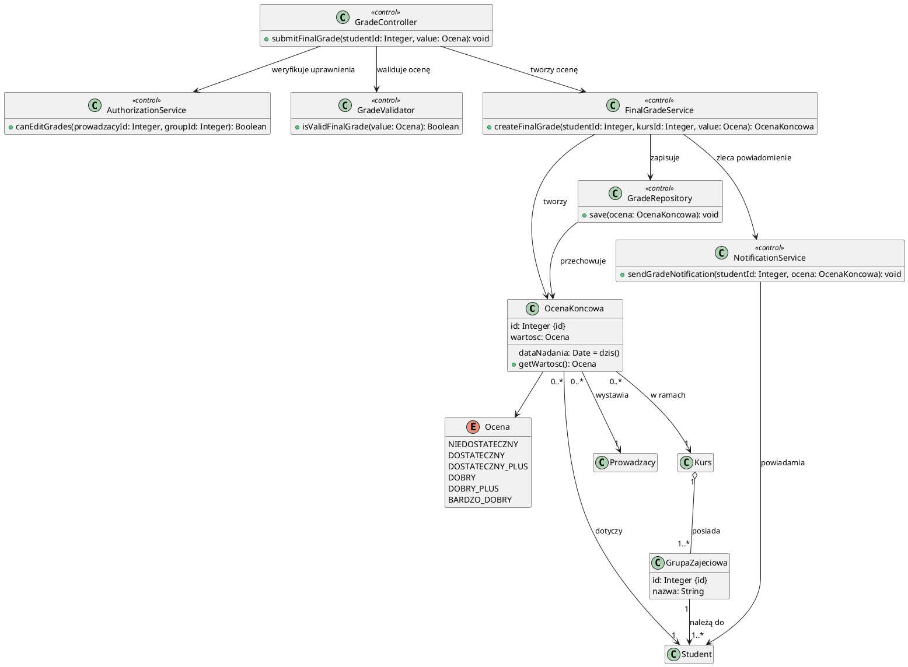

```plantuml

@startuml
hide empty members

' ─────────────────────────────────────────────
' Klasy dziedzinowe (encje)
' ─────────────────────────────────────────────

class OcenaKoncowa {
    id: Integer {id}
    wartosc: Ocena
    dataNadania: Date = dzis()
    + getWartosc(): Ocena
}

enum Ocena {
    NIEDOSTATECZNY
    DOSTATECZNY
    DOSTATECZNY_PLUS
    DOBRY
    DOBRY_PLUS
    BARDZO_DOBRY
}

' ─────────────────────────────────────────────
' Serwisy (warstwy logiki — z diagramu aktywności)
' ─────────────────────────────────────────────

class GradeController <<control>> {
    + submitFinalGrade(studentId: Integer, value: Ocena): void
}

class AuthorizationService <<control>> {
    + canEditGrades(prowadzacyId: Integer, groupId: Integer): Boolean
}

class GradeValidator <<control>> {
    + isValidFinalGrade(value: Ocena): Boolean
}

class FinalGradeService <<control>> {
    + createFinalGrade(studentId: Integer, kursId: Integer, value: Ocena): OcenaKoncowa
}

class GradeRepository <<control>> {
    + save(ocena: OcenaKoncowa): void
}

class NotificationService <<control>> {
    + sendGradeNotification(studentId: Integer, ocena: OcenaKoncowa): void
}

' ─────────────────────────────────────────────
' Powiązania z istniejącymi klasami (referencja)
' ─────────────────────────────────────────────

class Student
class Prowadzacy
class Kurs
class GrupaZajeciowa {
    id: Integer {id}
    nazwa: String
}

' ─────────────────────────────────────────────
' Relacje
' ─────────────────────────────────────────────

OcenaKoncowa "0..*" --> "1" Student    : dotyczy
OcenaKoncowa "0..*" --> "1" Prowadzacy : wystawia
OcenaKoncowa "0..*" --> "1" Kurs       : w ramach
OcenaKoncowa --> Ocena

Kurs "1" o-- "1..*" GrupaZajeciowa    : posiada
GrupaZajeciowa "1" --> "1..*" Student : należą do

GradeController --> AuthorizationService : weryfikuje uprawnienia
GradeController --> GradeValidator       : waliduje ocenę
GradeController --> FinalGradeService    : tworzy ocenę

FinalGradeService --> GradeRepository    : zapisuje
FinalGradeService --> OcenaKoncowa       : tworzy
FinalGradeService --> NotificationService : zleca powiadomienie

GradeRepository --> OcenaKoncowa         : przechowuje
NotificationService --> Student          : powiadamia

@enduml

```