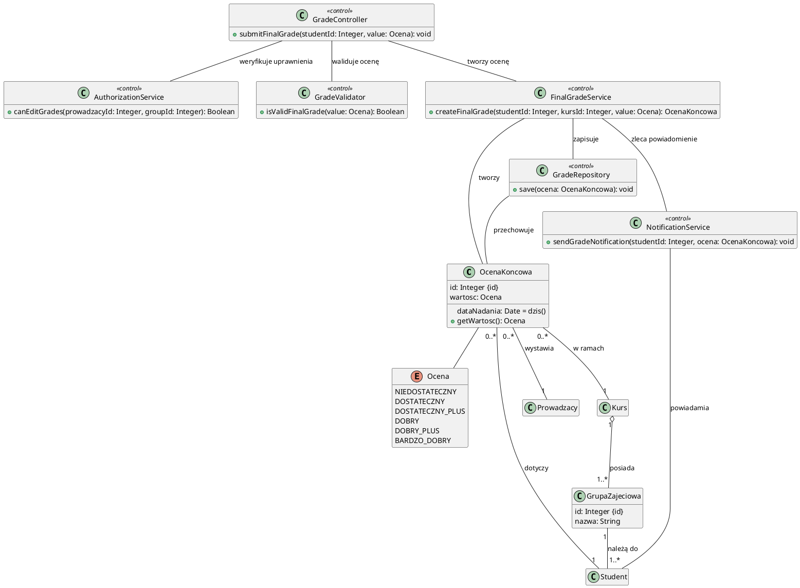

```plantuml

# Diagram klas — Wystawianie ocen

```plantuml
@startuml
hide empty members

' ─────────────────────────────────────────────
' Klasy dziedzinowe (encje)
' ─────────────────────────────────────────────

class OcenaKoncowa {
    id: Integer {id}
    wartosc: Ocena
    dataNadania: Date = dzis()
    + getWartosc(): Ocena
}

enum Ocena {
    NIEDOSTATECZNY
    DOSTATECZNY
    DOSTATECZNY_PLUS
    DOBRY
    DOBRY_PLUS
    BARDZO_DOBRY
}

' ─────────────────────────────────────────────
' Serwisy (z diagramu aktywności)
' ─────────────────────────────────────────────

class GradeController <<control>> {
    + submitFinalGrade(studentId: Integer, value: Ocena): void
}

class AuthorizationService <<control>> {
    + canEditGrades(prowadzacyId: Integer, groupId: Integer): Boolean
}

class GradeValidator <<control>> {
    + isValidFinalGrade(value: Ocena): Boolean
}

class FinalGradeService <<control>> {
    + createFinalGrade(studentId: Integer, kursId: Integer, value: Ocena): OcenaKoncowa
}

class GradeRepository <<control>> {
    + save(ocena: OcenaKoncowa): void
}

class NotificationService <<control>> {
    + sendGradeNotification(studentId: Integer, ocena: OcenaKoncowa): void
}

' ─────────────────────────────────────────────
' Klasy z istniejącego diagramu (referencja)
' ─────────────────────────────────────────────

class Student
class Prowadzacy
class Kurs
class GrupaZajeciowa {
    id: Integer {id}
    nazwa: String
}

' ─────────────────────────────────────────────
' Relacje
' ─────────────────────────────────────────────

' Asocjacja kierunkowa — OcenaKoncowa "zna" te klasy
OcenaKoncowa "0..*" -- "1" Student    : dotyczy
OcenaKoncowa "0..*" -- "1" Prowadzacy : wystawia
OcenaKoncowa "0..*" -- "1" Kurs       : w ramach
OcenaKoncowa -- Ocena

' Agregacja — GrupaZajeciowa istnieje w ramach Kursu, ale może istnieć bez niego
Kurs "1" o-- "1..*" GrupaZajeciowa    : posiada

' Asocjacja kierunkowa — GrupaZajeciowa grupuje studentów
GrupaZajeciowa "1" -- "1..*" Student : należą do

' Zależności między serwisami — zwykła linia (uses)
GradeController -- AuthorizationService : weryfikuje uprawnienia
GradeController -- GradeValidator       : waliduje ocenę
GradeController -- FinalGradeService    : tworzy ocenę

FinalGradeService -- GradeRepository    : zapisuje
FinalGradeService -- NotificationService : zleca powiadomienie

' Asocjacja kierunkowa — serwisy operują na encjach
FinalGradeService -- OcenaKoncowa       : tworzy
GradeRepository -- OcenaKoncowa         : przechowuje
NotificationService -- Student          : powiadamia

@enduml
```