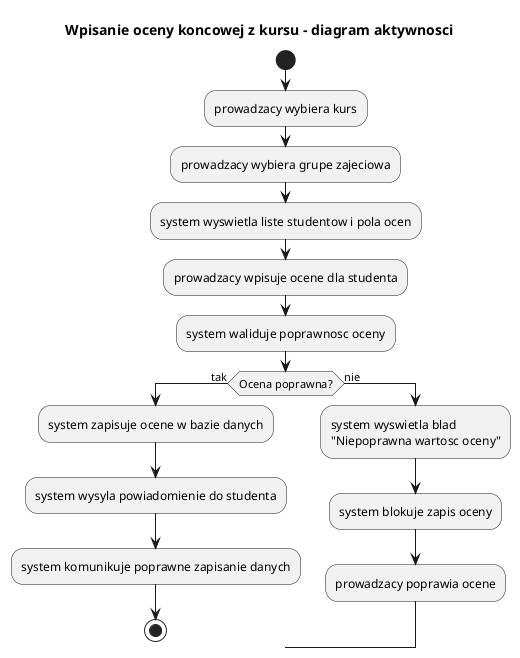

```plantuml
@startuml

title Wpisanie oceny koncowej z kursu - diagram aktywnosci

start

:prowadzacy wybiera kurs;
:prowadzacy wybiera grupe zajeciowa;
:system wyswietla liste studentow i pola ocen;
:prowadzacy wpisuje ocene dla studenta;
:system waliduje poprawnosc oceny;

if (Ocena poprawna?) then (tak)
  :system zapisuje ocene w bazie danych;
  :system wysyla powiadomienie do studenta;
  :system komunikuje poprawne zapisanie danych;
  stop
else (nie)
  :system wyswietla blad\n"Niepoprawna wartosc oceny";
  :system blokuje zapis oceny;
  :prowadzacy poprawia ocene;
  -> :system waliduje poprawnosc oceny;
endif

@enduml
```
